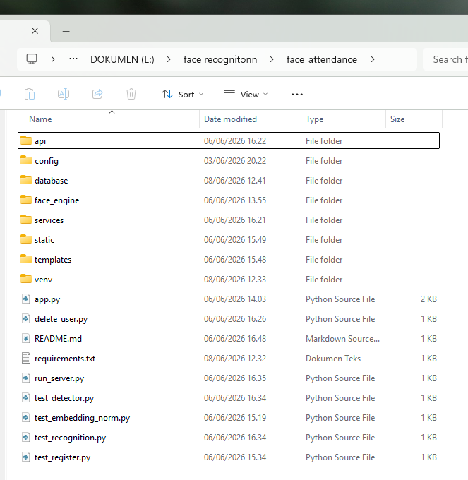
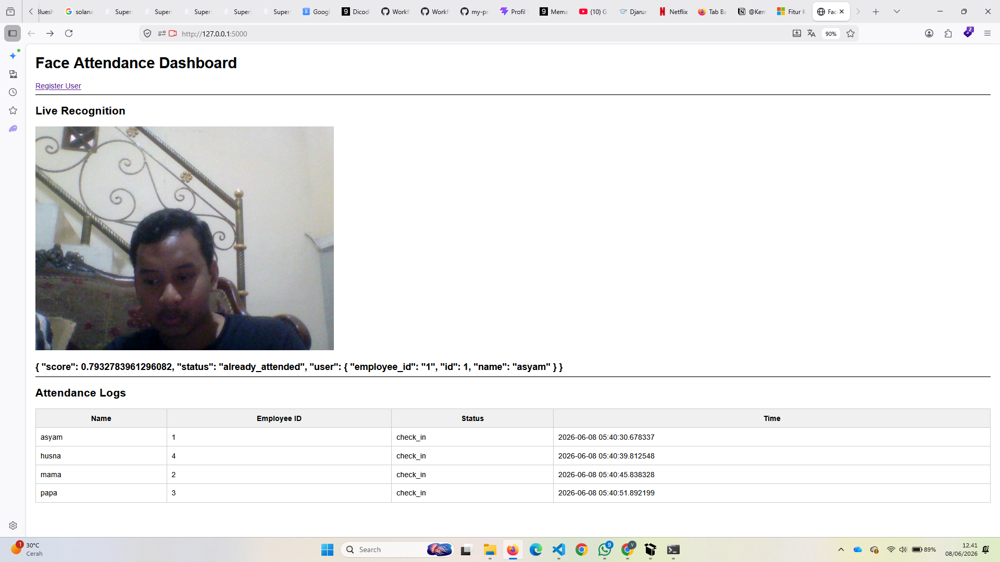
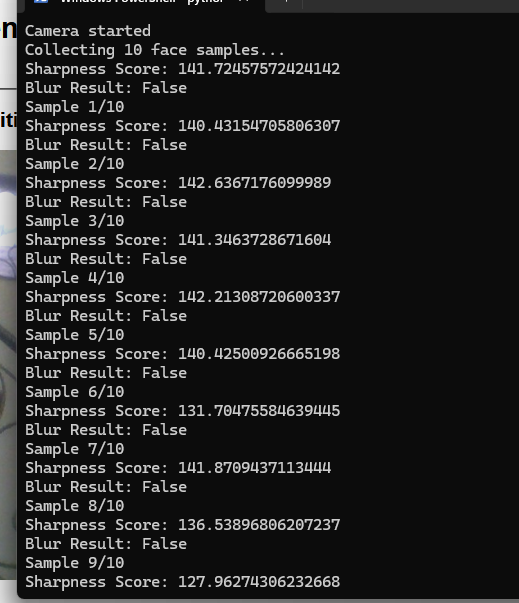
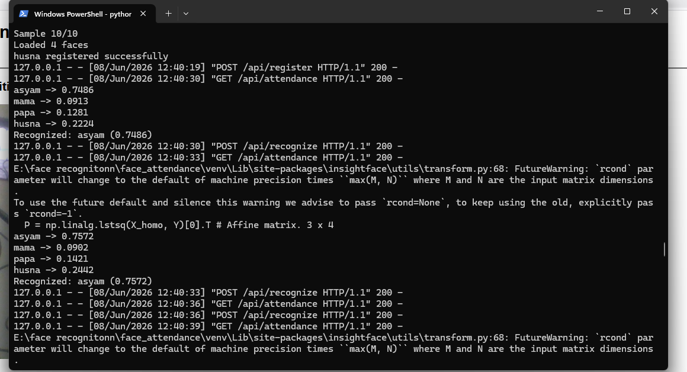

# 👁️ Face Attendance System

## ✨ By Andhika (Project Friend)

Sistem absensi otomatis berbasis **Face Recognition** menggunakan Python, Flask, OpenCV, dan InsightFace.

---

## 📸 Preview Project

### 🖥️ Dashboard / Home Page



### 📷 Face Recognition System



### 👤 Hasil




---

## 🚀 Features

- 👤 Face Registration (daftar wajah user)
- 📷 Real-time Face Recognition
- 🧾 Automatic Attendance Logging
- 🗑️ Delete user data
- 🌐 Web-based UI (Flask)
- 💾 Database SQLite / SQLAlchemy

---

## 🧠 Tech Stack

- Python 3.11
- Flask
- OpenCV
- InsightFace
- ONNX Runtime
- NumPy
- SQLAlchemy
- Matplotlib

---

## 📁 Project Structure

face_attendance/
│
├── api/
├── config/
├── database/
├── face_engine/
├── services/
├── static/
├── templates/
├── assets/ # 📸 images for README
│
├── app.py
├── run_server.py
├── delete_user.py
├── requirements.txt
└── README.md

---

## ⚙️ Installation

### 1. Clone Repository

```bash
git clone https://github.com/USERNAME/face_attendance.git
cd face_attendance
```

2. Create Virtual Environment
   python -m venv venv
3. Activate Virtual Environment

Windows:

venv\Scripts\activate 4. Install Dependencies
pip install --upgrade pip
pip install -r requirements.txt
▶️ Run Project
python run_server.py

Lalu buka browser:

http://127.0.0.1:5000
🧹 Delete User Data
python delete_user.py
⚠️ Important Notes
Gunakan Python 3.11
Jangan pakai Python 3.13 (belum kompatibel dengan beberapa AI library)
Pastikan folder venv/ di-ignore GitHub
Install semua dependency sebelum menjalankan project
📦 Requirements Fix (Jika Error)

Jika terjadi error dependency:

numpy==1.26.4
opencv-python==4.8.1.78
onnx==1.16.1
onnxruntime==1.18.1
matplotlib==3.8.4

Project ini dibuat oleh Andhika (teman pemilik repository) bukan asyam oke

📜 License

This project is for educational purposes only.
